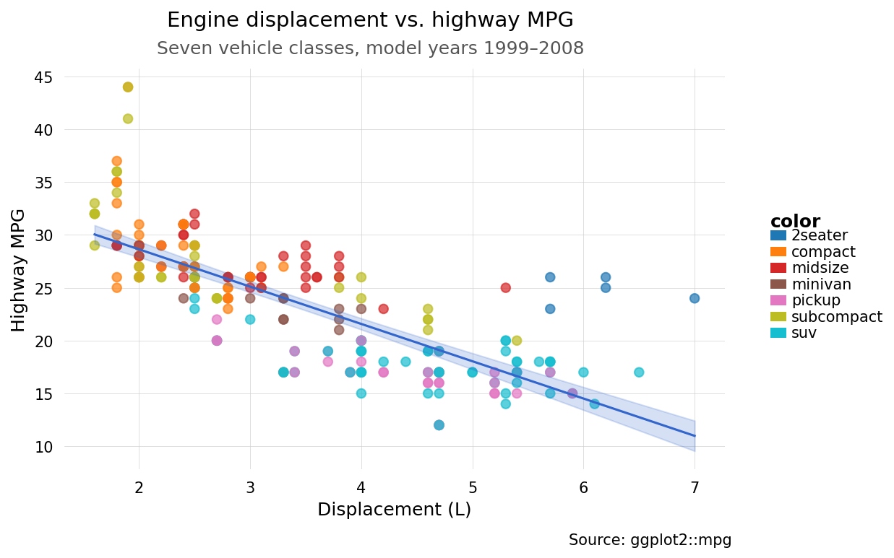

# plotten

**A grammar-of-graphics plotting library for Python — ggplot2's API, Python's ecosystem.**

[Documentation](https://briandconnelly.github.io/plotten) · [PyPI](https://pypi.org/project/plotten/)

---

If you've used ggplot2 in R, plotten will feel immediately familiar.
If you haven't, the grammar of graphics is a composable, layered approach to building charts: you describe *what* your data is and *how* it should be encoded visually, and the library handles the rest.
Built on [narwhals](https://github.com/narwhals-dev/narwhals), plotten works natively with pandas, polars, cuDF, and any other narwhals-supported DataFrame library.

```python
from plotten import ggplot, aes, geom_point, geom_smooth, labs
from plotten.datasets import load_dataset

mpg = load_dataset("mpg")

(
    ggplot(mpg, aes(x="displ", y="hwy", color="class"))
    + geom_point(alpha=0.7)
    + geom_smooth(method="ols")
    + labs(
        title="Engine displacement vs. highway MPG",
        subtitle="Seven vehicle classes, model years 1999–2008",
        caption="Source: ggplot2::mpg",
        x="Displacement (L)",
        y="Highway MPG",
    )
)
```



## Installation

```bash
uv add plotten
```

or with pip:

```bash
pip install plotten
```

## Features

- **45+ geometry layers** — point, line, bar, histogram, density, boxplot, violin, ridge, hex, contour, and many more
- **Automatic label repelling** — `geom_text_repel()` and `geom_label_repel()` reposition overlapping labels automatically
- **10 statistical layers** — `stat_ecdf`, `stat_summary`, `stat_ellipse`, `stat_cor`, and others computed on the fly
- **Computed aesthetics** — `after_stat()` and `after_scale()` for derived mappings
- **50+ scales** — color, fill, size, shape, alpha, linetype, Brewer, viridis, gradient, log, binned, and more
- **Full faceting** — `facet_wrap()` and `facet_grid()` with free/fixed scales, custom labellers, and configurable strips
- **12 built-in themes** — `theme_minimal`, `theme_tufte`, `theme_economist`, `theme_538`, and others; fully customizable with `theme()`
- **Plot composition** — combine plots with `|` and `/`, or use `plot_grid()` for arbitrary layouts with collected legends
- **Plot recipes** — `plot_waterfall()`, `plot_dumbbell()`, `plot_lollipop()`, `plot_slope()`, `plot_forest()`, `plot_waffle()`
- **Declarative spec API** — build plots from dicts or JSON with `from_spec()`; JSON Schema available via `spec_schema()`
- **Vega-Lite export** — convert any plot to a Vega-Lite spec or self-contained HTML
- **Accessibility auditing** — `accessibility_report()` checks colorblind safety, contrast, and font sizes
- **Helpful errors** — domain-specific exceptions with typo suggestions; strict mode for CI via `set_strict(True)`
- **Font support** — register custom or Google Fonts with `register_font()` / `register_google_font()`
- **Built-in datasets** — `diamonds`, `mtcars`, `iris`, `faithful`, `tips`, `mpg`, `penguins`
- **pandas and polars** — works with both via [narwhals](https://github.com/narwhals-dev/narwhals), no conversion needed

## Why plotten?

### For R/ggplot2 users

A faithful Python port of the ggplot2 mental model.
The same layered grammar, `aes()` mappings, `+` composition, and familiar function names.
`colour=` works as an alias for `color=` everywhere.

### For data analysts

Works with both pandas and polars out of the box.
Fifty-plus scales, nine position adjustments, and a full faceting system cover the long tail of real-world chart types without reaching for matplotlib directly.

### For scientists and publication authors

`ggsave()` defaults to 300 DPI and accepts `width`/`height` in inches, centimeters, or millimeters.
The accessibility auditor checks colorblind safety, contrast ratios, and font sizes before you submit.

---

For examples, guides, and the full API reference, visit the [documentation site](https://briandconnelly.github.io/plotten).

## License

MIT
