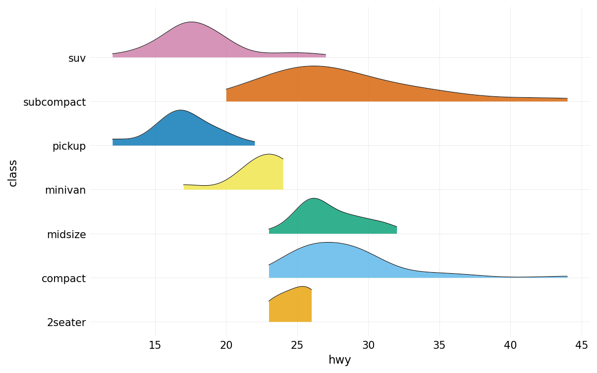
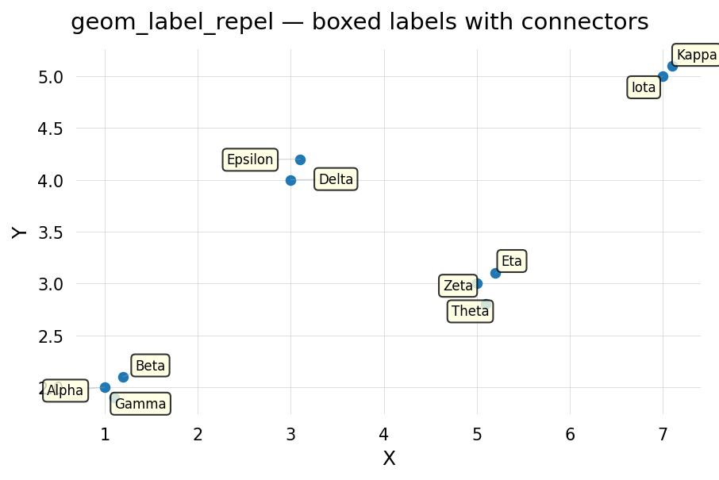
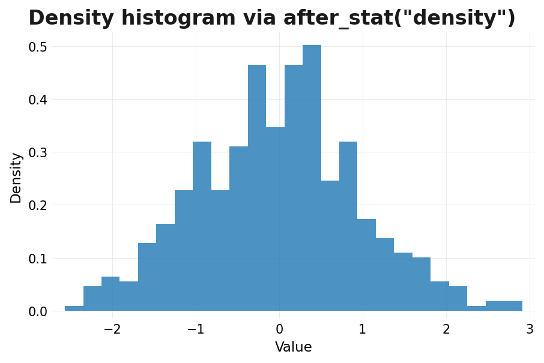
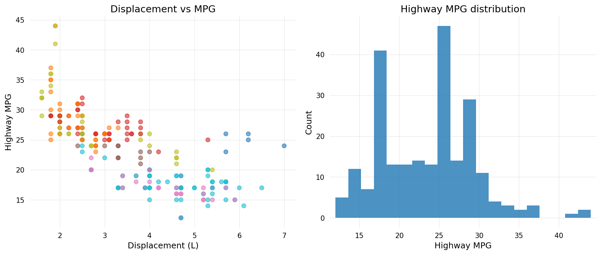

# Gallery

A selection of plots showcasing plotten's capabilities.
See the [examples directory](https://github.com/briandconnelly/plotten/tree/main/examples) for runnable scripts.

---

## Scatter with smooth and facets

```python
from plotten import ggplot, aes, geom_point, geom_smooth, facet_wrap
from plotten.datasets import load_dataset

mpg = load_dataset("mpg")

(
    ggplot(mpg, aes(x="displ", y="hwy"))
    + geom_point(aes(color="drv"), alpha=0.6)
    + geom_smooth(method="loess")
    + facet_wrap("class", ncol=3)
)
```


---

## Ridge plot

```python
from plotten import ggplot, aes, geom_density_ridges
from plotten.datasets import load_dataset

mpg = load_dataset("mpg")

(
    ggplot(mpg, aes(x="hwy", y="class"))
    + geom_density_ridges(alpha=0.8)
)
```



---

## Label repelling

```python
from plotten import ggplot, aes, geom_point, geom_text_repel

ggplot(df, aes(x="x", y="y", label="name")) + geom_point() + geom_text_repel()
```



---

## Computed aesthetics

```python
from plotten import ggplot, aes, geom_histogram, after_stat
from plotten.datasets import load_dataset

diamonds = load_dataset("diamonds")

ggplot(diamonds, aes(x="carat", y=after_stat("density"))) + geom_histogram()
```



---

## Plot composition

```python
from plotten import plot_grid

plot_grid([p1, p2, p3], ncol=2, guides="collect")
```


