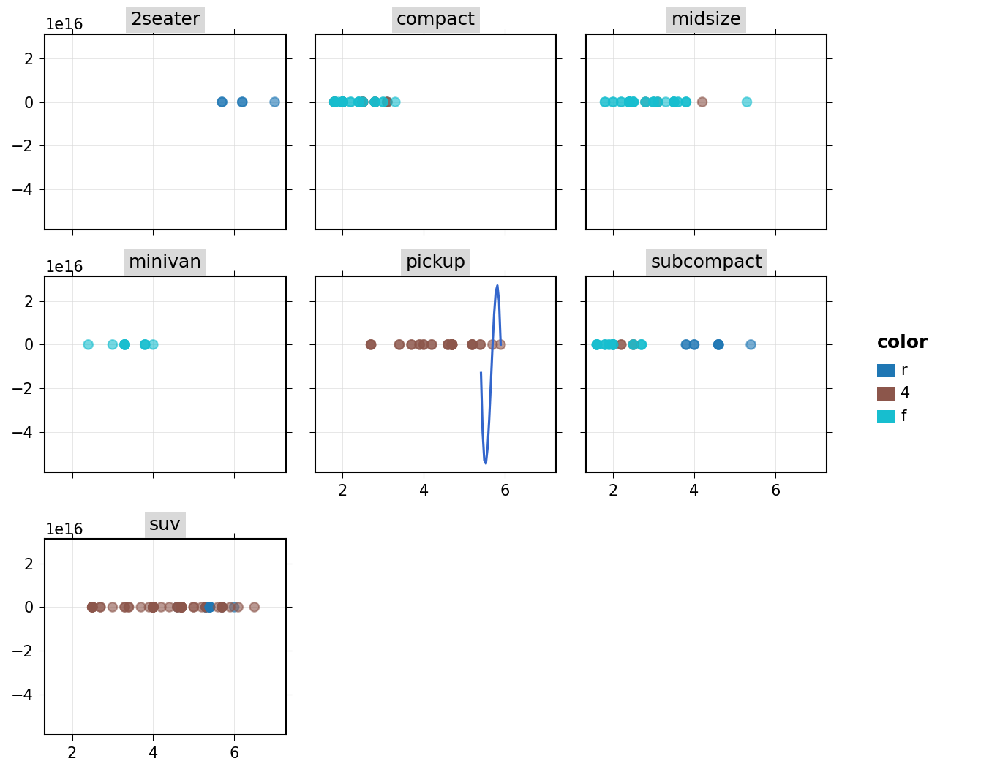

# Quick Start

## Your first plot

Every plot starts with `ggplot()` and an aesthetic mapping via `aes()`.
Add layers with the `+` operator.

```python
from plotten import ggplot, aes, geom_point
from plotten.datasets import load_dataset

mpg = load_dataset("mpg")

ggplot(mpg, aes(x="displ", y="hwy")) + geom_point()
```

## Adding layers

Stack multiple geometry layers to build up a plot:

```python
from plotten import ggplot, aes, geom_point, geom_smooth, labs

(
    ggplot(mpg, aes(x="displ", y="hwy"))
    + geom_point(mapping=aes(color="drv"), alpha=0.6)
    + geom_smooth(method="loess")
    + labs(
        title="Engine displacement vs. highway MPG",
        x="Displacement (L)",
        y="Highway MPG",
    )
)
```

## Faceting

Split a plot into subplots by a variable:

```python
from plotten import facet_wrap

(
    ggplot(mpg, aes(x="displ", y="hwy"))
    + geom_point(mapping=aes(color="drv"), alpha=0.6)
    + geom_smooth(method="loess")
    + facet_wrap("class", ncol=3)
)
```



## Customizing themes

Apply a built-in theme or customize individual elements:

```python
from plotten import theme_minimal, theme, element_text

(
    ggplot(mpg, aes(x="displ", y="hwy"))
    + geom_point()
    + theme_minimal()
    + theme(plot_title=element_text(size=16, weight="bold"))
)
```

## Saving plots

Export to any format supported by matplotlib:

```python
plot = ggplot(mpg, aes(x="displ", y="hwy")) + geom_point()
plot.save("figure.png", width=6, height=4, dpi=300)
```

## Using polars or pandas

plotten works with any DataFrame library supported by narwhals.
No conversion needed:

=== "Polars"

    ```python
    import polars as pl
    from plotten import ggplot, aes, geom_bar

    df = pl.DataFrame({"category": ["A", "B", "C", "A", "B", "A"]})
    ggplot(df, aes(x="category")) + geom_bar()
    ```

=== "pandas"

    ```python
    import pandas as pd
    from plotten import ggplot, aes, geom_bar

    df = pd.DataFrame({"category": ["A", "B", "C", "A", "B", "A"]})
    ggplot(df, aes(x="category")) + geom_bar()
    ```

## Next steps

- Browse the [Gallery](../gallery.md) for inspiration
- Explore the [API Reference](../reference/core.md) for details on every function
